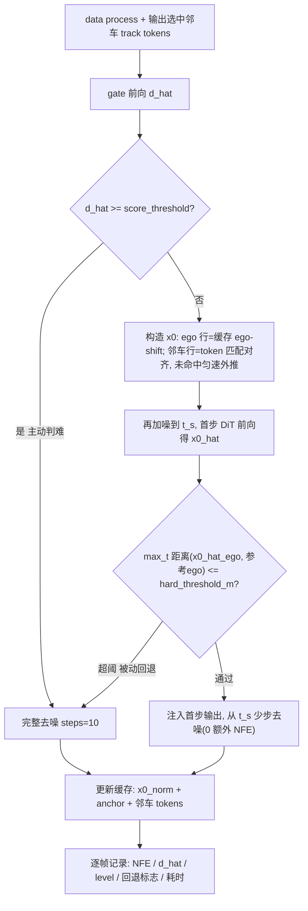

# gate_v2 闭环集成与 val14 评测计划

## 已敲定的决策(访谈结论)

- 一版到位:token 匹配 + 阈值回退全部实现,单元测试 + 单场景跑通后,直接跑一次全量 val14 CLS-NR(不建小开发集、不跑无回退中间版)。CLS-R 缓议。
- gate checkpoint 用 `ego_nbr_perstep`(d 量纲=米,与 CONTEXT.md"帧间变化距离"口径一致);prevd/norml2 留作后续消融。
- 邻车行做完整 token 匹配:上帧预测按 track token 对齐到当前帧 slot,未命中用当前观测匀速外推兜底。
- 阈值回退 ε 直接用 checkpoint 里的 `hard_threshold_m`(hard recall≥95% 标定,与 d 同量纲同语义),不扫参。
- 一步估计用"复用版":改采样器支持注入预算好的首步 model 输出,通过路径 0 额外 NFE,回退时 +1 NFE。
- 文档:CONTEXT.md 同时保留"场景门控(scene gate, encoding 版,未实现)"与新条目"轻量门控(lite gate, 原始观测版,已实现)";补 `0docs/adr/0003`(门控输入改用原始观测而非场景嵌入)。
- 加速叙事沿用 CONTEXT.md 口径:报"去噪 NFE / decoder GPU 延迟",非端到端。

## 现状与缺口

已有:`planner.py` 的 `gate_ckpt_path`/`enable_warmstart` 钩子、`decoder.py` warmstart 分支、`gate_v2` 的 warmstart/safety/d_to_ops/inference 全套、基线 CLS-NR 89.59(`0实验结果/DP-val14.md`)、decoder 延迟 profile(10 步约 19ms)。

缺口:邻车 slot 帧间错位未处理、无阈值回退、hydra yaml 未暴露 gate 参数、无逐帧 NFE/d_hat/回退记录、采样器无 NFE 计数与首步注入。

## 每帧推理流程(目标态)

## 实现步骤

### 1. 数据层:输出邻车 token

[diffusion_planner/data_process/data_processor.py](diffusion_planner/data_process/data_processor.py) 与 `agent_process.py`:`observation_adapter` 额外返回选中 32 邻车的 track token 列表(顺序与 `neighbor_agents_past` slot 一致),不进模型输入 dict 的 tensor 部分。

### 2. warmstart 层:邻车 token 匹配

[0hzxcode/gate_v2/warmstart.py](0hzxcode/gate_v2/warmstart.py):
- `WarmStartCache` 增加 `neighbor_tokens` 字段;
- `build_warmstart_init` 重写邻车行:命中 token → 取上帧该车预测行做 ego-shift;未命中 → 用当前帧观测位置+速度匀速外推构造 x0 行(归一化空间);ego 行逻辑不变。

### 3. 采样器:首步注入 + NFE 计数

[diffusion_planner/model/diffusion_utils/sampling.py](diffusion_planner/model/diffusion_utils/sampling.py) 与 `dpm_solver_pytorch.py`:
- `dpm_sampler`/`DPM_Solver.sample` 支持 `first_model_output` 参数,multistep 首步直接使用该值不再前向;
- model_fn 包一层计数器,采样结束返回实际 NFE。

### 4. decoder:一步估计验证 + 被动回退

[diffusion_planner/model/module/decoder.py](diffusion_planner/model/module/decoder.py) warmstart 分支:
- 对再加噪的 `x_init` 在 `t_start` 处做一次 DiT 前向得 `x0_hat`(x_start 模型直接输出);
- 反归一化后取 ego 行与参考轨迹(warmstart dict 传入的 ego-shift 缓存)逐点距离 max,与 `epsilon_m`(=hard_threshold_m)比较;
- 通过 → `first_model_output=x0_hat` 进采样器;超阈 → 丢弃 warm-start,标准纯噪声完整去噪(该次前向计入 NFE,记被动回退);
- 输出 meta:NFE、fallback 标志、d_meas。

### 5. controller / planner:串线 + 逐帧诊断

[0hzxcode/gate_v2/inference.py](0hzxcode/gate_v2/inference.py) 与 [diffusion_planner/planner/planner.py](diffusion_planner/planner/planner.py):
- warmstart dict 增加 `ref_ego_norm`、`epsilon_m`、邻车 tokens;
- planner 逐帧攒诊断记录(d_hat、level、t_start、steps、NFE、主动判难/被动回退、decoder 耗时 ms),每场景写一个 jsonl 到 `0hzxcode/gate_v2_output/val14_closedloop/`;
- `initialize()` 里调用 `gate_controller.reset()`(planner 本身每场景新建,此为双保险)。

### 6. 配置与脚本

- [diffusion_planner/config/planner/diffusion_planner.yaml](diffusion_planner/config/planner/diffusion_planner.yaml) 增加 `gate_ckpt_path: null`、`enable_warmstart: false`;
- 新增 `sim_gate_warmstart_runner.sh`(拷贝 val14 脚本,override 上述两参数指向 `0hzxcode/gate_v2_output/runs/ego_nbr_perstep/best.pt`)。

### 7. 验证(不跑全量前的门槛)

- 扩展 `0hzxcode/gate_v2/test_gate_v2.py`:token 匹配重排、匀速外推、首步注入等价性(注入 vs 不注入同输入输出一致)、回退分支触发;
- 用 hydra override 跑 1-2 个场景闭环(`scenario_filter.limit_total_scenarios`),确认:jsonl 有合理的 NFE/档位分布、无 crash、轨迹不发散。

### 8. 全量评测与汇总

- 跑全量 val14 CLS-NR 一次(1118 场景);
- 汇总报告写 `0实验结果/`:CLS-NR 总分及八项子指标 vs 基线 89.59;平均 NFE vs 基线 11;NFE 分布与档位分布;主动判难率/被动回退率;decoder 平均延迟加速倍数(逐帧计时聚合,对照 profile 基线 19ms);按场景类型分解。

### 9. 文档收尾

- CONTEXT.md:新增"轻量门控(lite gate)"条目,原"场景门控"标注为未实现的历史方案;补"主动判难/被动回退"术语;
- 新建 `0docs/adr/0003-raw-obs-gate-instead-of-encoding.md`。

## 风险

- 邻车匀速外推的 x0 质量差 → 有再加噪 + 阈值回退兜底,且 index-0 约束保留;
- warm-start 帧间自激 → 逐帧 jsonl 可查,必要时后续加"每 N 帧强制完整去噪";
- 一次全量成本高、无冒烟 → 用单场景验证 + 单元测试兜工程正确性(用户已拍板接受)。