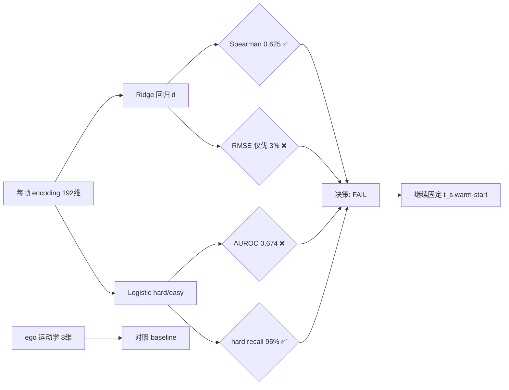

## M-probe 是什么

这是一次 **可行性探针（M-probe）** 的结果，用来回答一个问题：

> 冻结 Diffusion Planner 的 **encoder 输出 `encoding`（192 维场景嵌入）** 里，是否含有足够信号，能预测 **帧间变化距离 `d`**，从而支撑后续训练 **学习型 gate**（用 `d_hat` 自适应设定 warm-start 的 `t_s`）？

探针不过 → **先不要训 learned gate**，继续用 **固定 `t_s` warm-start**。

---

## 数据概况（`data` 段）

| 字段 | 含义 |
|---|---|
| **144,441 行** | 每行 = 一帧的 `(encoding, d, scenario_id)` |
| **1,118 个 scenario** | 按 scenario 划分 train/val/test，避免相邻帧泄漏 |
| **encoding_dim = 192** | encoder fusion 输出维度 |
| **ego_feature_dim = 8** | 对照用的 rule-based / 运动学特征 |

**标签 `d` 的分布：**

- 均值 **1.12 m**，标准差 **2.25 m**
- 中位数 **0.49 m**（多数帧变化不大）
- P90 **2.61 m**，P95 **4.02 m**，最大 **67.8 m**（少数极端难例）

**Hard/Easy 划分：**

- `hard_threshold = 2.63`：训练集 `d` 的 **90 分位**
- `hard_positive_rate ≈ 9.86%`：约 1/10 帧被标为「难」（`d > 阈值`）

这与自适应 warm-start 的设计一致：gate 要能提前识别「这帧变化大、需要更高 `t_s` 或完整去噪」的场景。

---

## 两套特征对比

探针用 **Ridge 回归** 预测连续 `d`，用 **Logistic 回归** 做 hard/easy 二分类，并和 **ego 运动学 baseline** 对比。

### 1. `encoding`（核心候选）

**回归（test）：**

| 指标 | 值 | 解读 |
|---|---:|---|
| RMSE | 2.25 | 预测误差量级接近 `d` 的标准差 |
| MAE | 0.87 | 平均绝对误差约 0.87 m |
| **Pearson** | 0.26 | 线性相关弱 |
| **Spearman** | **0.625** | **排序相关较好**——能大致分出「变化大/小」 |

Pearson 低、Spearman 高，说明 encoding 更擅长 **相对排序**，而不是精确回归绝对米数。

**分类（test）：**

| 指标 | 值 | 解读 |
|---|---:|---|
| AUROC | **0.674** | 区分 hard/easy 略优于随机，但未达门槛 |
| AP | 0.154 | 正样本稀少，AP 偏低 |
| hard recall | **0.952** | 95% 的难例被召回 |
| false easy rate | **0.048** | 约 4.8% 真难例被误判为 easy（漏检） |
| hard precision | 0.126 | 标为 hard 的里只有 ~12% 真是 hard（误报多） |

阈值在 val 上按 **hard recall ≥ 0.85** 校准，所以 recall 高、precision 低是预期 trade-off。

### 2. `ego_features`（对照 baseline）

| 指标 | 值 | 解读 |
|---|---:|---|
| RMSE | 2.32 | 与 encoding 接近 |
| Spearman | **0.0** | 预测与真实 `d` **无秩相关** |
| AUROC | **0.5** | 等同随机猜 |
| hard recall | 1.0 | 全判 hard → recall 虚高 |

Ridge 在 ego 特征上基本退化为 **预测均值**：RMSE 仍接近 `d` 的标准差，但 Spearman/AUROC 为 0/0.5，说明 **手工运动学特征几乎不能区分 hard/easy**。

---

## 决策结果：**FAIL**

```131:146:0hzxcode/m_probe_output/probe_results.json
  "decision": {
    "pass": false,
    "recommendation": "STOP: keep fixed t_s warm-start; do not train learned gate yet",
    "checks": {
      "spearman_ok": true,
      "auroc_ok": false,
      "hard_recall_ok": true,
      "rmse_improvement_vs_ego": 0.03144305484067467,
      "rmse_improvement_ok": false
    },
```

四项门槛（须 **全部通过**）：

| 检查项 | 门槛 | 实际 | 结果 |
|---|---|---|---|
| Spearman | ≥ 0.30 | **0.625** | ✅ |
| AUROC | ≥ 0.70 | **0.674** | ❌ 差 ~0.03 |
| hard recall | ≥ 0.85 | **0.952** | ✅ |
| RMSE 相对 ego 改善 | ≥ **15%** | **仅 3.1%** | ❌ 主要短板 |

**结论：**  
`encoding` 里 **有一点** 关于 `d` 的信号（排序、部分 hard 召回），但 **不足以支撑 learned gate**：

1. **回归增益太小**：相对 ego baseline，RMSE 只降 3.1%，远不到 15%。
2. **hard/easy 分类不够强**：AUROC 0.674 < 0.70，说明 embedding 对「要不要完整去噪」的判别力不足。
3. **ego baseline 虽弱，encoding 也没拉开足够差距**——BLUE 式主张「场景嵌入优于手工特征」在此数据集上 **尚未成立**。

`probe_report.md` 是上述 JSON 的可读摘要，内容与 JSON 一致。

---

## 直观理解（一张图）



---

## 实践建议

按 README 与探针设计，当前应：

1. **暂停** learned gate 训练路线。
2. **继续** Falcon phase-1：**固定 `t_s` warm-start + 一步估计 + 阈值回退**。
3. 若仍想走 gate 路线，需要先改善 **encoding → d** 的可预测性，例如：
   - 检查 `d` 标签与 encoder 输入是否对齐、pooling 方式是否合适；
   - 尝试更强 probe 模型或非线性 head（探针用 Ridge/Logistic 是 **下界**，正式 gate 可能略好，但 RMSE 只优 3% 说明信号本身偏弱）；
   - 扩大/清洗 probe 数据集，或换 `d` 定义做敏感性分析。

**一句话总结：** encoding 能 weakly 排序帧间变化，但 **既不能显著优于 ego baseline 做回归，也不能可靠区分 hard 帧**——探针未通过，自适应 `t_s` gate 现阶段 **不建议上**。