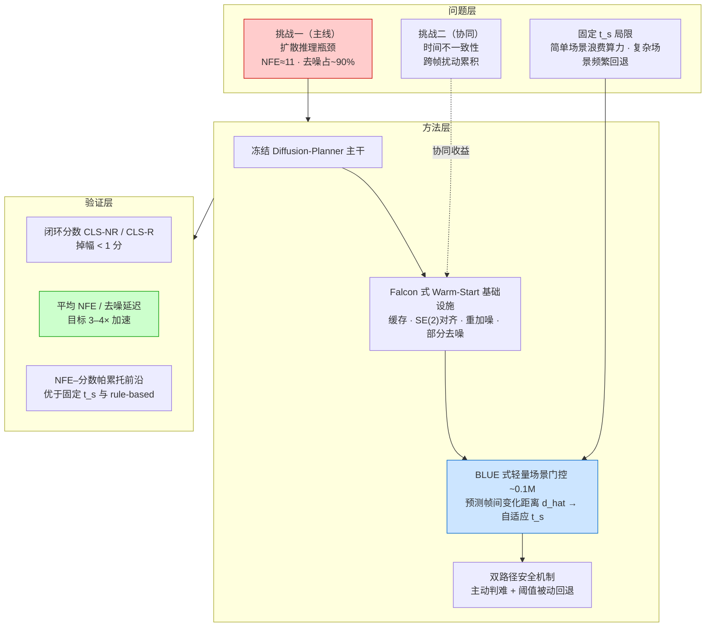
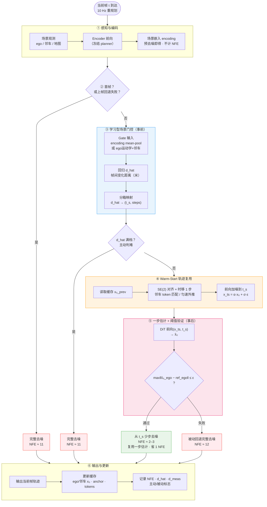
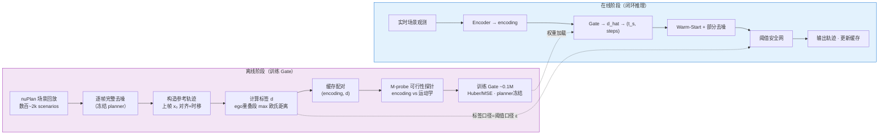
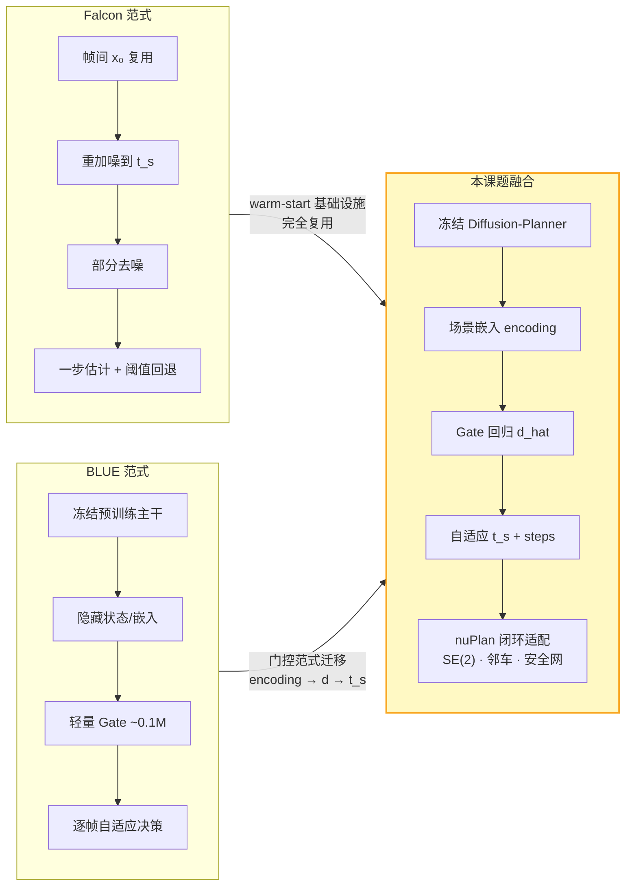
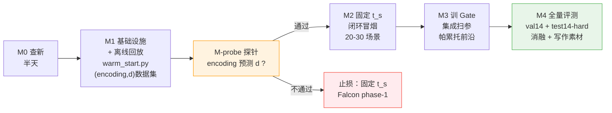
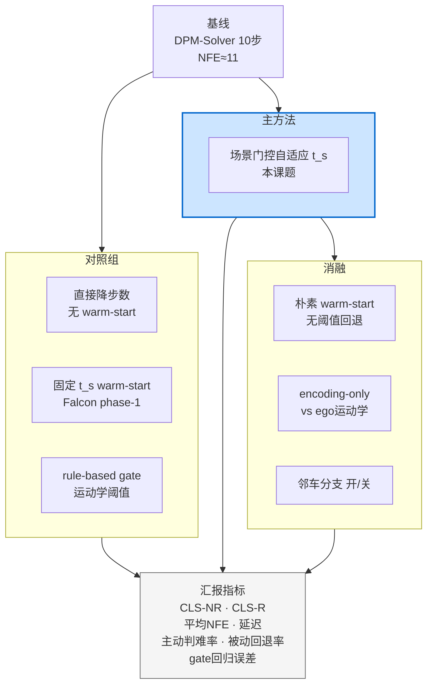

# 开题答辩总体框架图

> **课题**：基于学习型场景门控的扩散规划器自适应轨迹复用加速  
> **平台**：Diffusion-Planner + nuPlan 闭环仿真  
> **核心主线**：推理加速（NFE 11 → 2–3）；时间一致性为 warm-start 协同收益

---

## 图 1｜课题总体框架（三层结构）



**读图说明**

| 层级 | 内容 |
|---|---|
| 问题层 | 推理延迟是主线动机；时间不一致性是 warm-start 的额外收益；固定 \(t_s\) 引出自适应门控需求 |
| 方法层 | 冻结主干 → warm-start 基础设施 → 学习型门控 → 双路径安全网，四层递进 |
| 验证层 | 闭环分数、NFE/延迟、帕累托前沿三维验收 |

---

## 图 2｜单帧推理总体框架（核心方法图）



**三条到达「完整去噪」的路径**

| 路径 | 触发条件 | 性质 |
|---|---|---|
| 路径 A | 首帧 / 上帧回退失败 | 正常流程 |
| 路径 B | Gate 主动判难（\(d\) 满档） | **事前**跳过无效 warm-start |
| 路径 C | 阈值验证失败 | **事后**安全网被动回退 |

---

## 图 3｜离线训练与在线推理双管线



---

## 图 4｜与 Falcon / BLUE 的方法融合关系



---

## 图 5｜研究技术路线与里程碑



---

## 图 6｜评测矩阵总览



---

## 图 7｜ASCII 精简版（可直接贴入 PPT）

```
╔══════════════════════════════════════════════════════════════════════════╗
║          基于学习型场景门控的扩散规划器自适应轨迹复用加速                      ║
╠══════════════════════════════════════════════════════════════════════════╣
║  【问题】  推理瓶颈(NFE≈11)  +  时间不一致性  +  固定t_s失效               ║
╠══════════════════════════════════════════════════════════════════════════╣
║                                                                          ║
║   场景观测 ──► Encoder(冻结) ──► encoding ──► Gate(~0.1M)              ║
║                                      │              │                    ║
║                                      │         d_hat │ 分箱              ║
║                                      │              ▼                    ║
║   缓存 x₀_prev ──► SE(2)对齐+时移 ──► 重加噪到t_s ──► 部分去噪           ║
║        ▲                                    │                            ║
║        │                              一步估计+阈值ε                       ║
║        │                           ┌────────┴────────┐                   ║
║        │                           ▼                 ▼                   ║
║        │                      通过(NFE≈2-3)    回退(NFE≈11)             ║
║        └──────── 更新缓存 ◄──── 输出轨迹                                  ║
║                                                                          ║
╠══════════════════════════════════════════════════════════════════════════╣
║  【训练】  离线回放 → (encoding,d) → M-probe → 训Gate（planner冻结）       ║
║  【验证】  val14/test14-hard · CLS-NR/R · NFE/延迟 · 帕累托前沿           ║
╚══════════════════════════════════════════════════════════════════════════╝
```

---

## 图例与关键符号

| 符号 | 含义 |
|---|---|
| \(x_0\) | 去噪后的干净轨迹 |
| \(t_s\) | 重加噪起始时刻（噪声水平） |
| \(d\) / \(\hat{d}\) | 帧间变化距离（标签 / 预测值，物理空间米） |
| \(\varepsilon\) | 阈值回退判定边界 |
| NFE | 神经网络函数评估次数（去噪步数 + 一步估计） |
| encoding | Encoder fusion 输出的场景嵌入 |
| Gate | 单隐层 MLP，约 0.1M 参数，推理不计 NFE |

---

## 使用建议

| 场景 | 推荐图示 |
|---|---|
| 开题答辩开场（30 秒鸟瞰） | **图 1** 三层结构 |
| 方法核心讲解（2–3 分钟） | **图 2** 单帧推理流程 |
| 解释「如何训练 Gate」 | **图 3** 离线/在线双管线 |
| 说明与 Falcon/BLUE 关系 | **图 4** 融合关系 |
| 研究计划汇报 | **图 5** 里程碑 |
| 实验设计汇报 | **图 6** 评测矩阵 |
| PPT 不便渲染 Mermaid 时 | **图 7** ASCII 版 |

> Mermaid 图可在 VS Code、Typora、GitHub 或 [mermaid.live](https://mermaid.live) 中预览与导出 PNG/SVG。
